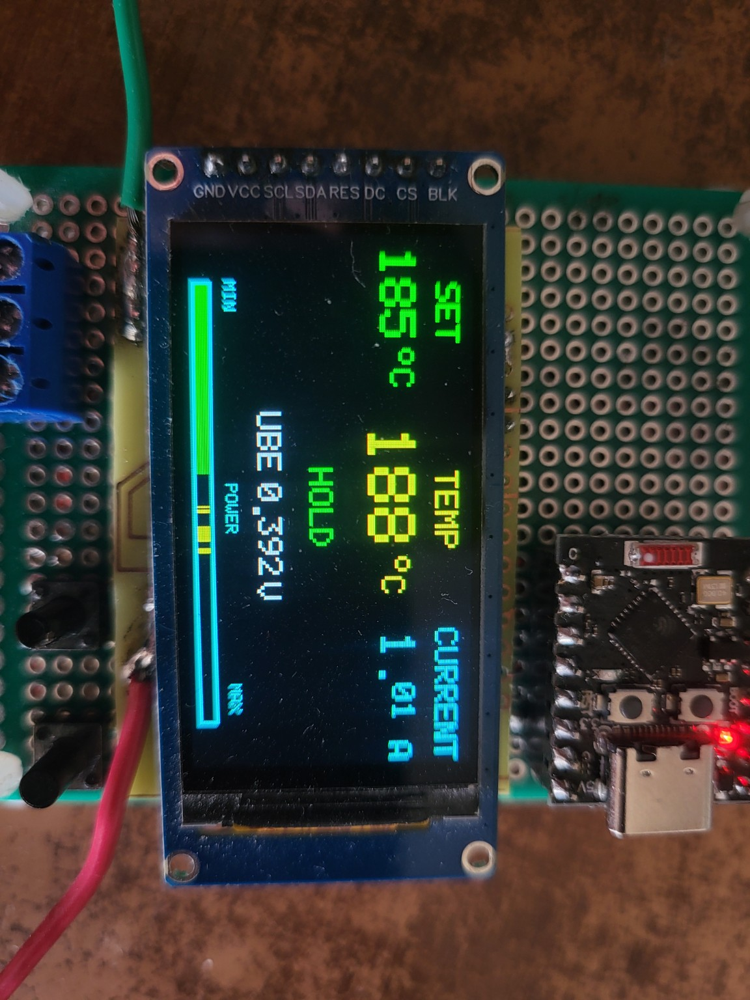
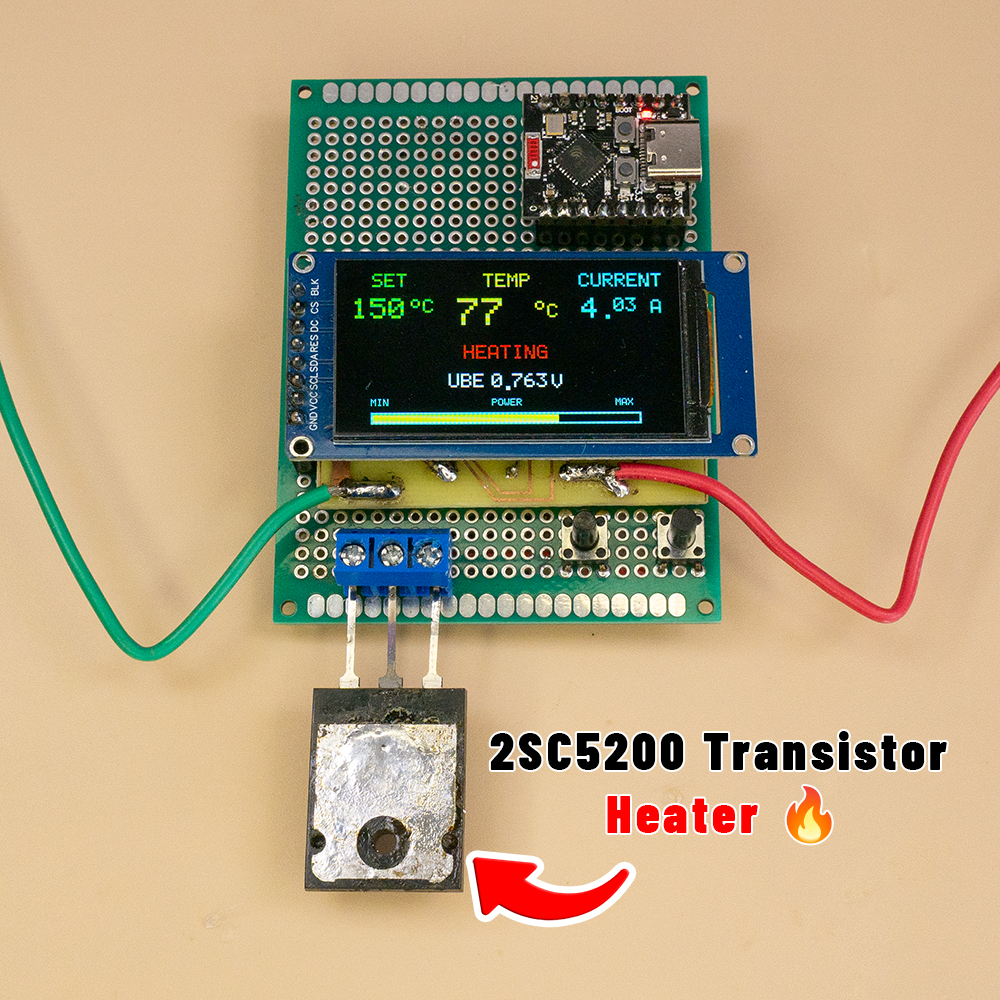
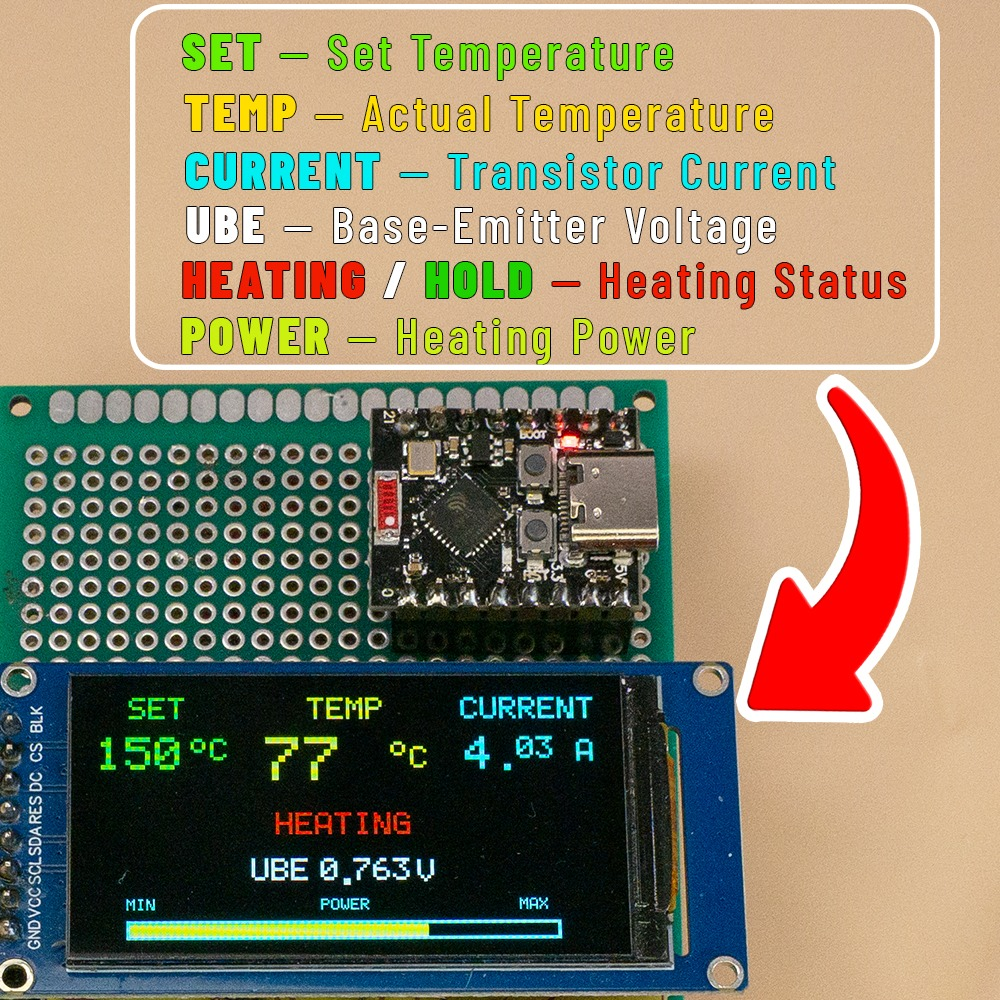
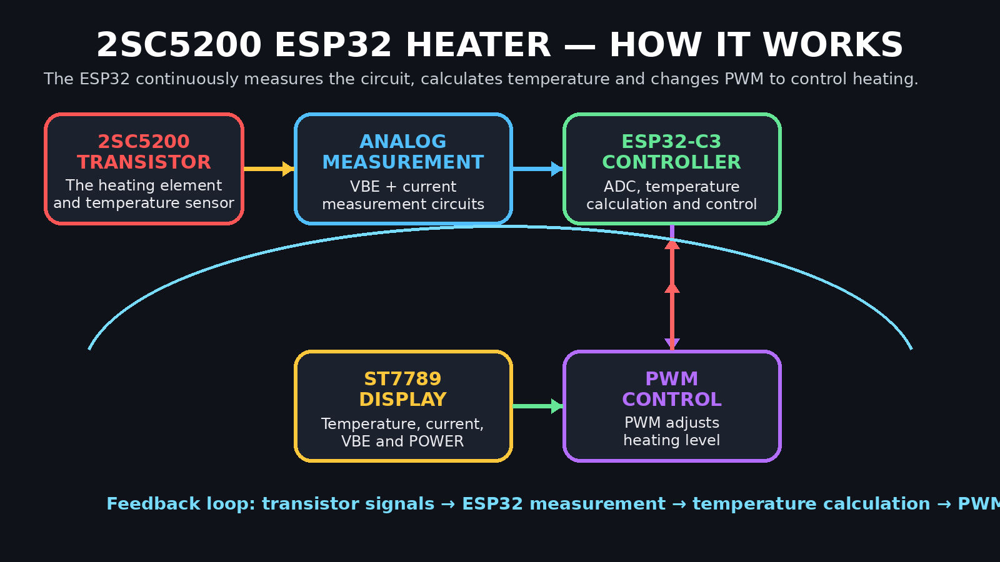
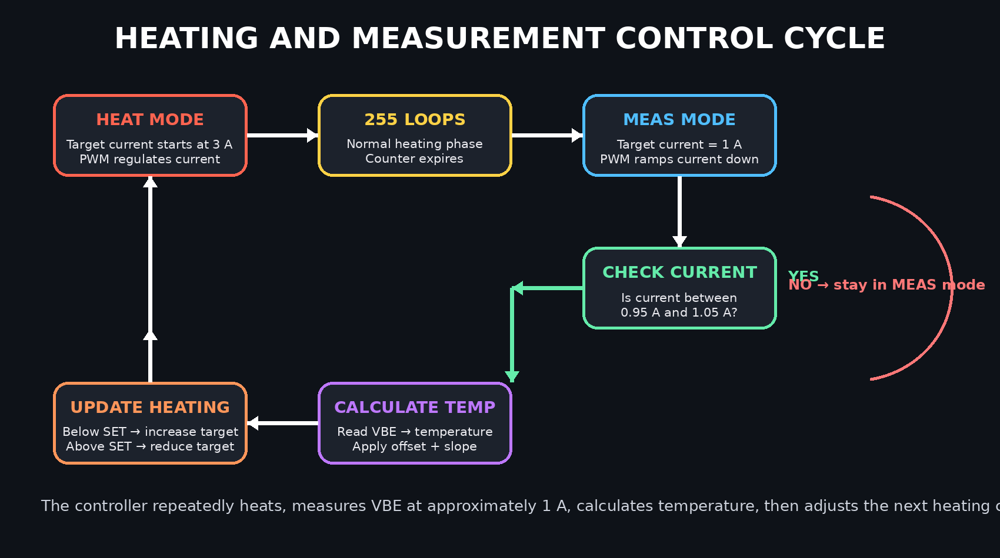
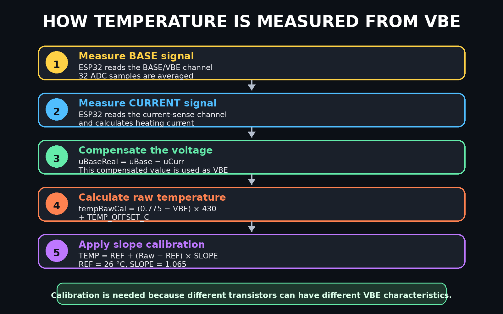

# 🔥 2SC5200 ESP32 Temperature Controller

> A DIY transistor heater controlled by an **ESP32-C3 Super Mini**, with real-time temperature measurement through the transistor's **base-emitter voltage (VBE)**, closed-loop current control, a **170×320 ST7789 color display**, and adjustable temperature control from **150 °C to 250 °C**.



## 📸 The Finished Device



The finished prototype combines the **2SC5200 transistor heater**, **ESP32-C3 Super Mini**, **ST7789 color display**, analog measurement circuit, and two temperature adjustment buttons into one compact experimental controller.

---

## 📺 What the Display Shows



The display provides real-time information about the heater:

- **SET** — selected target temperature
- **TEMP** — measured transistor temperature
- **CURRENT** — measured heating current
- **VBE** — compensated base-emitter voltage used for temperature measurement
- **HEATING / HOLD** — current operating status
- **POWER** — current PWM control level shown as a visual bar

A detailed explanation of every value is provided below.


---

## ✨ Project Overview

This project turns a **2SC5200 power transistor** into a controllable heater.

The ESP32-C3 performs several jobs at the same time:

- Controls the transistor using **PWM**
- Measures the transistor's base/emitter sensing voltage
- Measures heating current
- Calculates temperature from the transistor's **VBE**
- Automatically adjusts heating power
- Displays the important operating information on a color ST7789 display
- Allows the target temperature to be changed with two buttons

The project is compact and designed as a practical DIY electronics experiment.

> ⚠️ **Important:** This is an experimental project. A power transistor can become extremely hot. Use a suitable heatsink or controlled mechanical mounting, proper wiring, and a safe power supply. Do not leave the heater unattended.

---

# 📺 Display

The display is rotated into landscape orientation and is divided into several information areas.

## 1. SET

**SET** is the target temperature selected by the user.

The temperature can be adjusted with two buttons:

- **TEMP +** → increases the target temperature
- **TEMP −** → decreases the target temperature

Current limits:

```text
Minimum: 150 °C
Maximum: 250 °C
Step:     5 °C
```

For example:

```text
SET = 200 °C
```

means that the controller will try to maintain the transistor heater around 200 °C.

---

## 2. TEMP

**TEMP** is the measured temperature of the 2SC5200 transistor.

The ESP32 does not use a separate thermistor or digital temperature sensor.

Instead, the temperature is estimated from the transistor's:

```text
Base-Emitter Voltage → VBE
```

As the transistor temperature changes, its base-emitter voltage changes. The controller periodically measures this voltage under controlled conditions and converts it into temperature.

The temperature calculation includes:

- an offset calibration
- a slope calibration

because individual transistors can have different VBE characteristics.

---

## 3. CURRENT

**CURRENT** shows the measured electrical current flowing through the heater/transistor circuit.

The ESP32 reads the current-sense signal through the analog measurement circuit and converts the measured voltage into amperes.

The firmware uses the following conversion:

```text
Current = uCurr × (1.05 / 0.05)
```

which is approximately:

```text
Current = uCurr × 21
```

The current reading is also used by the control algorithm.

---

## 4. POWER

**POWER** is the current **PWM control level**.

It is important to understand that:

> POWER is not measured electrical power in watts.

The POWER bar shows how strongly the ESP32 is currently driving the heater using PWM.

### How it works

When the heater is cold:

```text
PWM increases
→ transistor receives more drive
→ heating current increases
→ heater warms faster
```

As the measured temperature approaches the target:

```text
PWM / drive level is reduced
→ heating current is reduced
→ heating becomes gentler
```

The POWER bar gives a quick visual indication of the current PWM level.

### POWER bar colors

The bar changes color depending on the PWM level:

```text
GREEN  → lower PWM level
YELLOW → medium PWM level
RED    → high PWM level
```

The maximum display scale corresponds to the firmware's PWM operating limit.

---

## 5. VBE

**VBE** shows the calculated base-emitter voltage used for temperature measurement.

The displayed value is:

```text
uBaseReal = uBase − uCurr
```

This subtraction is used to compensate the measured base signal using the current-related voltage.

The resulting VBE value is then used by the temperature calculation.

---

# 🧩 How the Whole System Works



The heater works as a closed-loop system:

1. The **2SC5200 transistor** generates heat.
2. The analog circuit provides signals related to **base-emitter voltage and current**.
3. The **ESP32-C3** reads these signals with its ADC.
4. The firmware calculates **current and compensated VBE**.
5. During the measurement phase, the firmware calculates the transistor temperature.
6. The controller changes the heating target and regulates the transistor with **PWM**.
7. The ST7789 display shows the most important operating information in real time.

# 🔁 Heating and Measurement Cycle



The firmware alternates between a normal heating phase and a controlled measurement phase.

> **Important:** In the current firmware, the measurement phase does not accept a temperature sample until the measured current reaches the acceptance window of **0.95–1.05 A**. This keeps the VBE measurement closer to the intended measurement condition.


# 🧠 How the Temperature Measurement Works

## The basic idea




A bipolar transistor has a base-emitter junction that behaves similarly to a diode.

The voltage across this junction changes with temperature.

For a given transistor and controlled operating condition:

```text
Temperature changes
        ↓
VBE changes
        ↓
ESP32 measures VBE
        ↓
Firmware converts VBE into temperature
```

However, the VBE of one transistor is not exactly identical to the VBE of another transistor.

That is why this project includes calibration.

---

# 🔄 Why the Heater Uses a Measurement Mode

Accurate VBE-based temperature measurement requires controlled measurement conditions.

During normal heating, the transistor can operate at a much higher current.

Because VBE depends not only on temperature but also on transistor current, the firmware periodically switches into a dedicated measurement mode.

The current firmware uses two operating modes:

```text
MODE_OPERATING
MODE_MEAS
```

---

## 🔥 MODE_OPERATING

During normal heating:

```text
Current target starts around 3 A
Maximum allowed target = 4 A
```

The controller adjusts PWM until the measured current is close to the current target.

The control window is approximately:

```text
Target ± 0.025 A
```

If the current is too low:

```text
PWM + 1
```

If the current is too high:

```text
PWM − 1
```

This creates a simple closed-loop current controller.

The normal operating phase runs for approximately:

```text
255 control loops
```

---

## 📏 MODE_MEAS

After the heating phase, the controller switches to measurement mode.

The measurement current target is:

```text
1.0 A
```

The firmware then adjusts PWM until the real measured current reaches the acceptance window:

```text
0.95 A to 1.05 A
```

Only after the current is inside this window is the VBE sample accepted.

This is important because it makes the temperature measurement more consistent.

The measurement process is therefore:

```text
Normal heating
      ↓
Switch to measurement mode
      ↓
PWM is adjusted toward 1 A
      ↓
Measured current reaches 0.95–1.05 A
      ↓
Read and calculate VBE
      ↓
Calculate temperature
      ↓
Return to normal heating mode
```

---

# 📐 Temperature Calculation

The current firmware uses the following raw temperature formula:

```text
tempRawCal =
(0.775 − VBE) × 430 + TEMP_OFFSET_C
```

Where:

```text
VBE = uBaseReal
TEMP_OFFSET_C = 13 °C
```

The offset was added because the raw transistor-based calculation initially showed approximately 13 °C when the real ambient temperature was approximately 26 °C.

---

## Two-Point Calibration

A single offset is often not enough.

A transistor can also have a different temperature response slope.

Therefore the firmware applies a slope correction around the calibrated ambient reference temperature.

The current formula is:

```text
TEMP =
TEMP_CAL_REF_C +
(tempRawCal − TEMP_CAL_REF_C) × TEMP_SLOPE
```

Current project values:

```cpp
const float TEMP_OFFSET_C  = 13.0f;
const float TEMP_CAL_REF_C = 26.0f;
const float TEMP_SLOPE     = 1.065f;
```

This means:

### Calibration reference point

```text
26 °C remains 26 °C
```

while the temperature response above the reference point is adjusted using the slope.

---

# 🧪 Why Calibration Is Needed

Different 2SC5200 transistors can have different:

- base-emitter voltage
- gain
- VBE versus temperature characteristics
- manufacturing tolerances

Therefore a temperature formula that works perfectly for one transistor may not be perfect for another one.

For this reason, the firmware keeps the calibration values easy to change.

The main calibration parameters are:

```cpp
const float TEMP_OFFSET_C  = 13.0f;
const float TEMP_CAL_REF_C = 26.0f;
const float TEMP_SLOPE     = 1.065f;
```

---

# 🔧 Calibration Procedure

## Step 1 — Ambient calibration

Allow the transistor to reach room temperature.

Measure the real ambient temperature using a reliable thermometer.

Compare it with the temperature shown by the controller.

Adjust:

```cpp
TEMP_OFFSET_C
```

until the controller agrees with the known ambient temperature.

---

## Step 2 — High-temperature calibration

A second calibration point is required to correct the slope.

For this project, Sn60Pb40 solder was used as a practical reference.

Sn60Pb40 is a non-eutectic solder alloy with a melting range rather than one perfectly sharp melting point.

The project calibration was adjusted experimentally by observing solder behavior.

Adjust:

```cpp
TEMP_SLOPE
```

carefully until the high-temperature reading agrees with a reliable reference.

> ⚠️ A solder-melting test is useful as an experimental indicator, but a calibrated temperature reference is more accurate for final calibration.

---

# ⚡ Control Algorithm

The control system operates in a repeating cycle.

```text
                ┌──────────────────────┐
                │   Read ADC signals   │
                └──────────┬───────────┘
                           │
                           ▼
                ┌──────────────────────┐
                │ Calculate CURRENT    │
                │ and compensated VBE  │
                └──────────┬───────────┘
                           │
                           ▼
                ┌──────────────────────┐
                │ Current controller   │
                │ adjusts PWM          │
                └──────────┬───────────┘
                           │
                           ▼
                    ┌────────────┐
                    │ HEAT MODE? │
                    └─────┬──────┘
                          │
             ┌────────────┴────────────┐
             ▼                         ▼
     Continue heating           Enter MEAS mode
                                       │
                                       ▼
                              Control current to 1 A
                                       │
                                       ▼
                             Is current 0.95–1.05 A?
                                       │
                              ┌────────┴────────┐
                              │                 │
                             NO                YES
                              │                 │
                              ▼                 ▼
                       Keep regulating      Measure VBE
                                                │
                                                ▼
                                        Calculate TEMP
                                                │
                                                ▼
                                     Adjust heating target
                                                │
                                                ▼
                                      Return to HEAT mode
```

---

# 🎯 Temperature Regulation

The measured temperature is compared with the user-selected target.

If the heater is below the target temperature:

```text
Operating current target increases by 5%
```

If the heater is above the target:

```text
Operating current target decreases by approximately 5%
```

The operating current target is limited to:

```text
Maximum = 4.0 A
```

This target current is then maintained by the PWM current controller.

In simplified form:

```text
TEMP too low
    ↓
Increase current target
    ↓
PWM regulator increases drive
    ↓
More heating

TEMP too high
    ↓
Reduce current target
    ↓
PWM regulator reduces drive
    ↓
Less heating
```

---

# 🔌 ESP32-C3 Pinout

## Heater and Analog Measurement

| ESP32-C3 GPIO | Function |
|---|---|
| GPIO5 | Heater PWM output |
| GPIO0 | Base/VBE analog measurement |
| GPIO3 | Current analog measurement |

---

## ST7789 Display

| ESP32-C3 GPIO | ST7789 Pin |
|---|---|
| GPIO4 | SCLK |
| GPIO6 | SDA / MOSI |
| GPIO7 | DC |
| GPIO1 | RST |
| GPIO10 | CS |
| 3.3 V | VCC |
| GND | GND |

> The exact ST7789 module pin names may vary. Some modules label MOSI as **SDA**, and some provide additional pins such as **BLK**.

---

## Temperature Buttons

The buttons are connected between GPIO and GND.

```text
GPIO20 ─── Button ─── GND
             │
          TEMP −
```

```text
GPIO21 ─── Button ─── GND
             │
          TEMP +
```

The firmware uses:

```cpp
INPUT_PULLUP
```

Therefore:

```text
Button released → HIGH
Button pressed  → LOW
```

No external pull-up resistor is required for the basic button connection.

---

# 🖥️ Display Update Strategy

The display is not completely redrawn every time.

Instead, the firmware updates only the changing values.

Examples:

- SET temperature
- current temperature
- current
- PWM / POWER bar
- system status
- VBE value

This helps reduce unnecessary display flickering.

The POWER bar also has dedicated redraw handling to prevent old colored pixels from remaining visible when PWM decreases or when the bar changes color.

---

# 📊 PWM Configuration

The heater PWM is configured as:

```text
Frequency: 62.5 kHz
Resolution: 8-bit
```

Firmware configuration:

```cpp
ledcAttach(PIN_PWM_BASE, 62500, 8);
```

The current control algorithm limits the PWM value to:

```text
0 to 192
```

The POWER bar uses PWM value 192 as its displayed maximum.

Therefore:

```text
PWM = 192 → POWER bar = MAX
```

---

# 🧮 Analog Measurement

The ESP32 ADC is configured for:

```text
12-bit resolution
ADC_11db attenuation
```

Firmware:

```cpp
analogReadResolution(12);

analogSetPinAttenuation(
    PIN_SENS_BASE,
    ADC_11db
);

analogSetPinAttenuation(
    PIN_SENS_CURRENT,
    ADC_11db
);
```

Each analog measurement is averaged over:

```text
32 ADC samples
```

This reduces random ADC noise.

The average ADC voltage is calculated using:

```text
Voltage =
ADC_raw × 3.3 / 4095
```

The firmware then applies the measurement scaling used by the analog front end.

For the base channel:

```text
uBase = ADC_voltage / 3.2
```

For the current channel:

```text
uCurr = ADC_voltage / 13
```

The compensated VBE value is:

```text
uBaseReal = uBase − uCurr
```

---

# 📁 Repository Structure

```text
2SC5200_ESP32_Temperature_Controller/
│
├── README.md
│
├── Firmware/
│   └── ESP32C3_2SC5200_Temperature_Controller.ino
│
├── Images/
│   ├── heater_display.jpg
│   ├── device_overview.jpg
│   ├── display_information.jpg
│   ├── how_it_works.png
│   ├── vbe_temperature_measurement.png
│   └── control_cycle.png
│
└── Docs/
    └── CALIBRATION.md
```

---

# 🚀 Installation

## 1. Install Arduino IDE

Install the Arduino IDE.

## 2. Install ESP32 board support

Add support for the ESP32-C3 board in Arduino IDE.

## 3. Open the firmware

Open:

```text
Firmware/
ESP32C3_2SC5200_Temperature_Controller.ino
```

## 4. Select the board

Select the appropriate ESP32-C3 board configuration.

For this project:

```text
ESP32-C3 Super Mini
```

## 5. Connect the hardware

Connect:

- transistor control circuit
- analog measurement circuit
- ST7789 display
- temperature buttons

according to the pinout above.

## 6. Upload the firmware

Connect the ESP32-C3 by USB and upload the sketch.

---

# 🛠️ Serial Monitor

The firmware outputs diagnostic information at:

```text
115200 baud
```

The monitor displays values such as:

```text
MODE
TEMP
CURRENT
CURRENT TARGET
PWM
BASE RAW
CURRENT RAW
uBase
uCurr
uBaseReal
CYCLE
```

These values are useful during development and calibration.

---

# ⚠️ Safety

This project can generate high temperatures and significant current.

Please observe the following:

- Use a suitable power supply.
- Use wiring capable of carrying the required current.
- Do not touch the transistor while operating.
- Keep flammable materials away.
- Do not leave the heater unattended.
- Disconnect power before changing wiring.
- Verify the analog input voltages are safe for the ESP32-C3 ADC.
- Use additional independent hardware protection if the project will be used for anything beyond experimentation.

This repository is provided as a DIY experimental project.

---

# 🔮 Possible Future Improvements

Ideas for future versions:

- Hardware over-temperature shutdown
- Independent external temperature sensor for comparison
- PID temperature control
- Stored calibration values in ESP32 NVS
- On-screen calibration menu
- Real power calculation in watts
- Input voltage measurement
- Heater resistance calculation
- Temperature graph
- Data logging
- Custom PCB
- 3D printed enclosure

---

# 📸 Media

If you build this project, feel free to share your version and modifications.

Project by **SMD VIBE**.

---

## ⭐ If You Like This Project

Give the repository a star ⭐ and follow the project for future updates.
